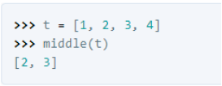

1.Escreva uma função chamada `repeating` que tome uma lista e retorne True se houver algum elemento que apareça mais de uma vez. Ela não deve modificar a lista original.

2. Crie um programa onde o usuário possa digitar cinco valores numéricos e cadastre-os em uma lista, já na posição correta de inserção. No final, mostre a lista ordenada na tela.

3. Escreva uma função chamada `middle` que receba uma lista e retorne uma nova lista com todos os elementos originais, exceto os primeiros e os últimos elementos. Por exemplo:

4. Crie um programa que vai ler vários números e colocar em uma lista. Depois disso, crie duas listas extras que vão conter apenas os valores pares e os valores ímpares digitados, respectivamente. Ao final, mostre o conteúdo das três listas geradas.

5. Crie um programa que vai ler vários números e colocar em uma lista. Depois disso, mostre: 
    a) Quantos números foram digitados. 
    b) A lista de valores, ordenada de forma decrescente. 
    c) Se o valor 5 foi digitado e está ou não na lista.

6. Uma pilha implementa os mecanismos de inserção/remoção: 
    a) FIFO 
    b) FIFA 
    c) LIFO 
    d) FFLL 
    e) N.D.A 

7. Uma fila implementa o mecanismo de inserção/remoção: 
    a) FIFO 
    b) FIFA 
    c) LIFO 
    d) FFLL 
    e) N.D.A 

8. Considere a seguinte sequência de comandos sobre uma Pilha P inicialmente vazia: 
    `P.push(7)` 
    `P.push(5)` 
    `P.pop()` 
    `P.push(3)` 
    `P.push(9)` 
    `P.push(1)` 
    `P.top()` 
    `P.push(4)` 
    `P.pop()`
    `P.pop()`

8.1. Assinale a alternativa incorreta: 
    a) Há apenas elementos ímpares na pilha. 
    b) A soma dos elementos que saíram é o dobro do primeiro elemento retirado. 
    c) O primeiro elemento retirado foi o 5. 
    d) O último elemento retirado foi o 1. 
    e) N.D.A. 